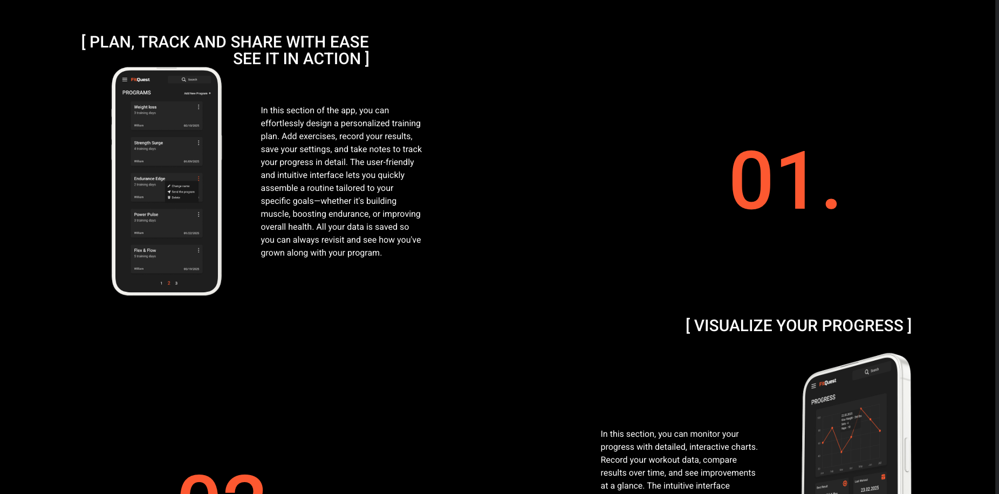
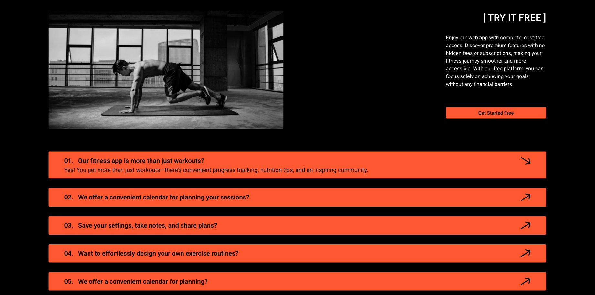
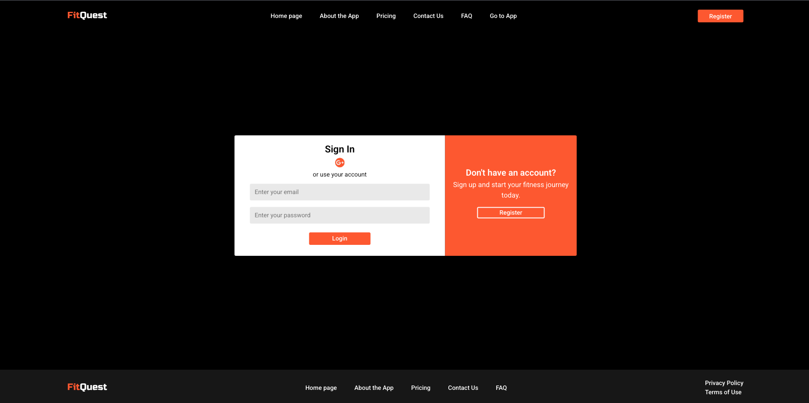
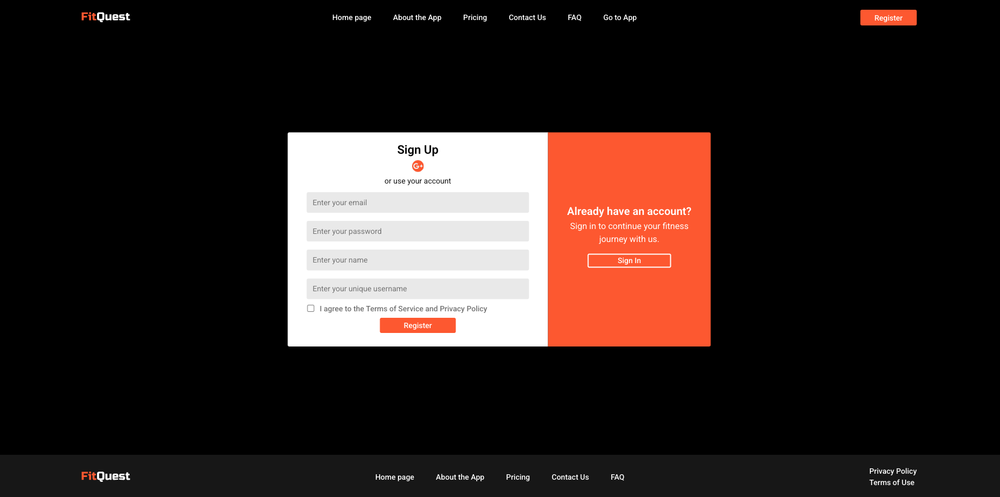
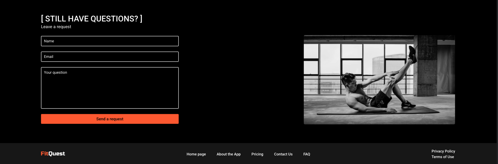
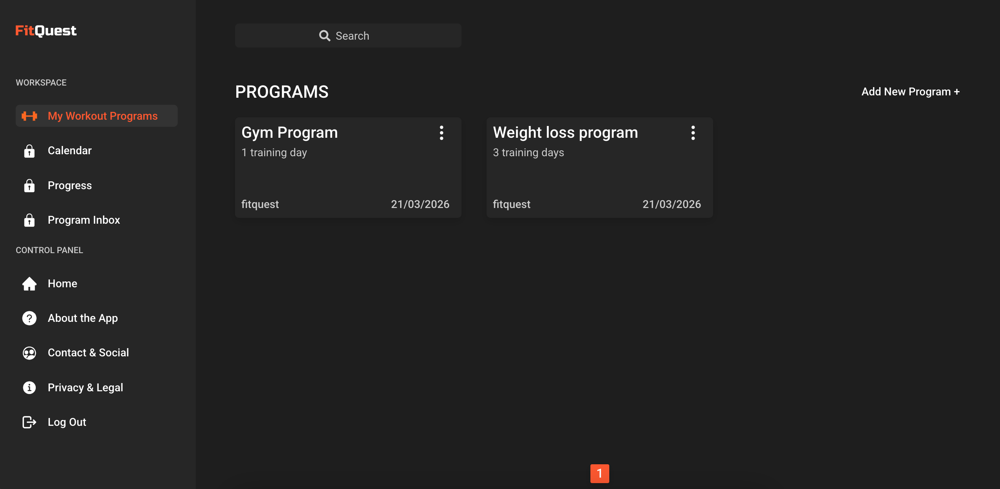
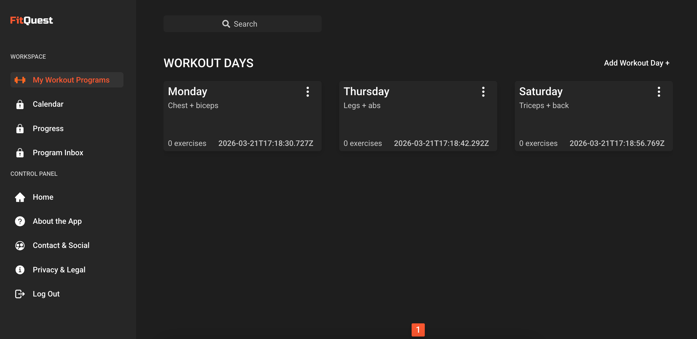
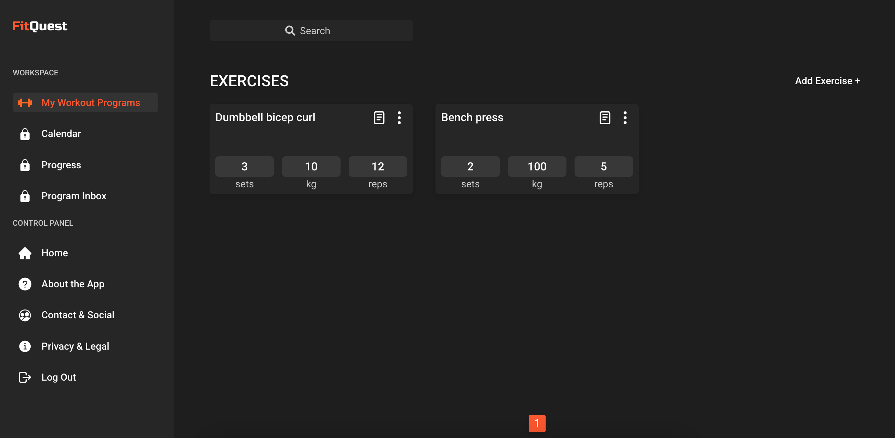
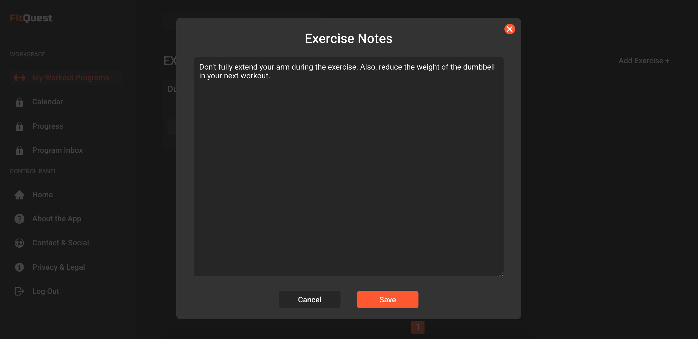

# FitQuest

**Live Demo:** [fitquest.fit](https://fitquest.fit/)  
**Backend Repository:** [FitQuest_Backend](https://github.com/slava-oliinyk-dev/FitQuest_Backend)  
**Backend API:** [fitnesswebbackend-production-9672.up.railway.app](https://fitnesswebbackend-production-9672.up.railway.app/)  
**Screenshots:** [See the Screenshots section below](#screenshots)

## Project Overview

FitQuest is a React-based fitness web application for planning workouts and managing training routines.

It combines a public landing page with an authenticated user area where users can create workout programs, organize workout days, and manage exercises with details such as sets, reps, weight, and notes.

This repository contains the frontend application. It communicates with a separate backend API for authentication, workout data management, and contact requests. The project demonstrates practical frontend patterns such as reusable components, route protection, API integration, authentication flows, and responsive UI design.

## Key Highlights

- Built a responsive React application with public and protected routes
- Integrated email/password authentication and Google Sign-In
- Connected the frontend to an external backend API
- Implemented nested CRUD flows for programs, workout days, and exercises
- Organized the app around reusable components, route-level pages, and shared API helpers

## Why I Built This Project

I built this project to practice creating an application that feels closer to a real product than a small training project. I wanted to work not only with UI components and pages, but also with authentication flows, protected routes, backend integration, and a more structured frontend architecture.

The fitness domain was also a good choice because it is easy to understand from a user perspective and works well for building realistic CRUD flows. It allowed me to practice how users move through an application, from the landing page to registration, login, and workout management inside the app.

## Features

### Public Website

- Landing page with sections for:
  - About
  - Pricing
  - FAQ
  - Contact
- Privacy Policy page
- Terms of Use page
- Cookie notice modal

### Authentication

- Email and password registration
- Email and password login
- Email confirmation resend flow
- Google sign-in with Firebase Authentication
- Protected routes for authenticated users
- Redirect logic for public and private pages

### Workout Management

- Create, view, edit, and delete workout programs
- Create, view, edit, and delete workout days inside a program
- Create, view, edit, and delete exercises inside a workout day
- Update exercise name, sets, reps, and weight
- Add notes to exercises

### UI / UX

- Responsive layout
- Reusable modal components
- Pagination for lists
- Empty-state messages for new users

## Tech Stack

### Frontend

- React 18
- React Router
- Sass
- Create React App

### Authentication

- Firebase Authentication
- Google Sign-In

### API / Data

- Fetch API
- Custom API request helper
- Cookie-based authentication with backend

### Tooling

- ESLint
- Prettier
- Jest
- React Testing Library

### Deployment

- Vercel for frontend hosting
- API rewrite or proxy setup for backend requests

## Architecture / Project Structure

```txt
src/
├── api/                 # API helpers and base URL logic
├── assets/              # Images, icons, gifs
├── components/          # Reusable UI components
├── pages/               # Route-level pages and app screens
├── styles/              # Global Sass styles, variables, mixins
├── AuthContext.tsx      # Global auth state
├── ProtectedRoute.tsx   # Protected route wrapper
├── PublicRoute.tsx      # Public-only route wrapper
├── firebaseConfig.tsx   # Firebase setup
├── index.js             # React entry point
└── main.js              # Main route definitions
```

The application follows a component-based structure:

- **Pages** represent route-level screens
- **Components** are reusable UI building blocks
- **API helpers** centralize request logic and response handling
- **Auth context** manages global authentication state
- **Route guards** control access to public and private pages

The authenticated part of the application is organized around a simple workout hierarchy:

```txt
Program -> Workout Day -> Exercise
```

This makes the data flow easier to understand and keeps the UI focused on one level at a time.

## API Overview

This frontend connects to an external backend API.

### Auth Endpoints Used

- `GET /users/me`
- `POST /users/register`
- `POST /users/login`
- `POST /users/logout`
- `POST /users/re-email`
- `GET /users/firebase-redirect`

### Workout Endpoints Used

- `GET /program`
- `POST /program`
- `PUT /program/:id`
- `DELETE /program/:id`
- `GET /day/:programId/days`
- `POST /day/:programId/days`
- `PUT /day/:programId/days/:dayId`
- `DELETE /day/:programId/days/:dayId`
- `GET /exercise/:dayId/exercises`
- `POST /exercise/:dayId/exercises`
- `PUT /exercise/:dayId/exercises/:exerciseId/note`
- `DELETE /exercise/:dayId/exercises/:exerciseId`

### Other Endpoint Used

- `POST /telegram/consultation`

### API Handling

The project uses a shared API helper to:

- resolve the correct API base URL
- support local development and deployed environments
- parse JSON responses
- normalize request errors

## Getting Started

### Prerequisites

Make sure you have installed:

- Node.js
- npm

### Installation

```bash
git clone <your-repository-url>
cd FitQuest_Frontend
npm install
```

### Environment Setup

Create a .env file in the project root and add the required variables listed below.

### Start Development Server

```bash
npm start
```

The app will run on http://localhost:3000.

### Production Build

```bash
npm run build
```

## Environment Variables

Create a `.env` file and configure the following values:

```env
REACT_APP_API_URL=
REACT_APP_FIREBASE_API_KEY=
REACT_APP_FIREBASE_AUTH_DOMAIN=
REACT_APP_FIREBASE_PROJECT_ID=
REACT_APP_FIREBASE_STORAGE_BUCKET=
REACT_APP_FIREBASE_MESSAGING_SENDER_ID=
REACT_APP_FIREBASE_APP_ID=
REACT_APP_FIREBASE_MEASUREMENT_ID=
```

### Notes

- `REACT_APP_API_URL` is used for backend API requests
- Firebase variables are used for Google authentication
- Do not commit real secrets to the repository

## Available Scripts

```bash
npm start
npm run build
npm test
npm run test:coverage
npm run format
npm run prettier
npm run lint:fix
```

## Known Limitations

- This repository contains the frontend only
- Some sidebar sections are still placeholders:
  - Calendar
  - Progress
  - Program Inbox
- The search UI is present, but full search functionality is not implemented yet
- Automated test setup exists, but the current test coverage is still limited
- Some parts of the UI could be further improved for polish and consistency

## Future Improvements

- Complete the Calendar section
- Add progress tracking and visual statistics
- Implement Program Inbox functionality
- Add real search and filtering across workout data
- Improve automated test coverage
- Add user profile settings
- Improve form validation and error feedback
- Add better documentation for backend setup and deployment

## What I Learned

Through this project, I improved my understanding of how to structure a frontend application in a more scalable way. I practiced splitting the UI into reusable components, organizing route-level pages, and keeping authentication logic separate through context and route guards.

I also gained more hands-on experience with integrating a frontend with a backend API. This included sending authenticated requests, handling user sessions, working with CRUD flows, and managing UI states for loading, empty results, and user actions. Building the authentication flow also helped me better understand protected routes, redirect logic, and Firebase-based Google sign-in.

Another important part of this project was learning how to connect product structure with frontend implementation. Instead of building isolated pages, I had to think about how the whole user flow works, from the landing page to registration, login, and workout management inside the app.

Overall, this project helped me feel more confident building a frontend application that is closer to a real product than a simple training React project.

## Screenshots

### Home Page


### About App



### Pricing



### Login



### Register



### Consultation Form



### Program Page



### Workout Day



### Exercise Details



### Exercise Notes


